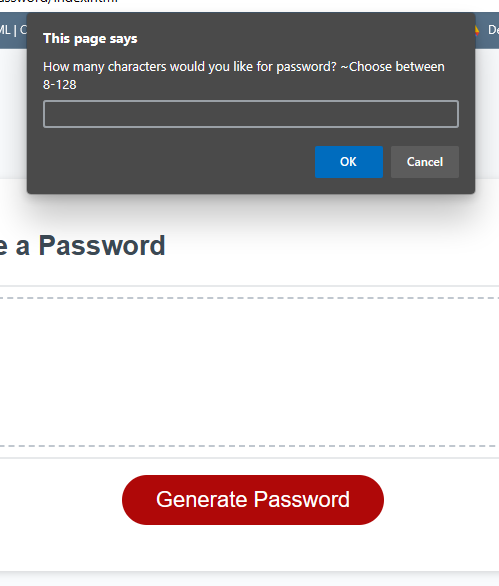
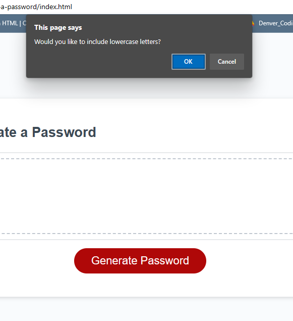
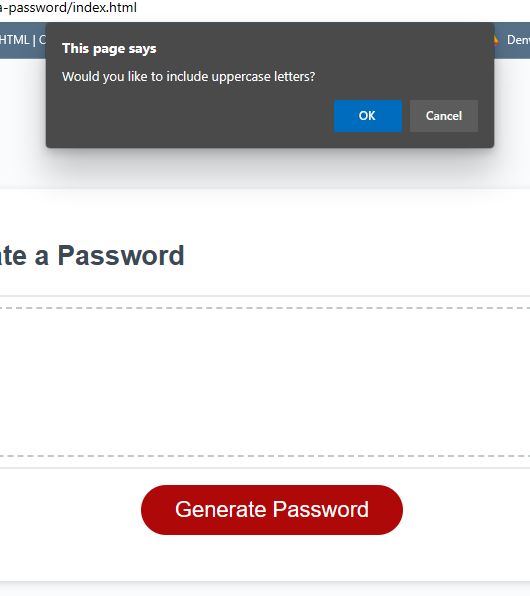
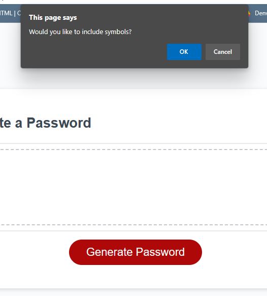
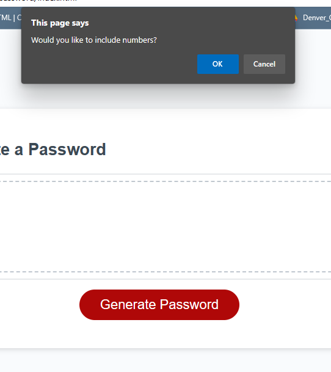
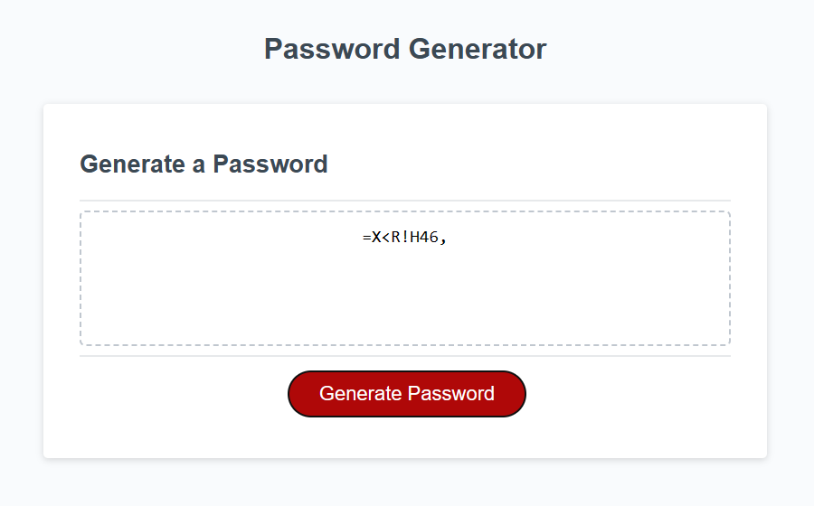

# grow-a-password

## Description

This project is a password generator. A lot of websites/apps require a unique password at least 8 characters long that are a mix of letters (upper and lowercase), numbers, and/or symbols. This is an easy way to generate a unique one up to 128 characters long.

I tried writing this code 5+ different ways- from creating a generic function to call to and run the code, to creating a working function for each confirm and pass on a new array that could be concatenated in the end. Anything from having one giant long if/else conditional.

They didn't work lol.

This was the code that ran the function and showed the correct output.

## Installation

N/A

## Usage

Visit page:
https://d-lil.github.io/grow-a-password/

After clicking "Generate Password" button, the page will prompt for:

Character count (from 8-128)

Confirm if user wants lowercase letters included

Confirm if user wants uppercase letters included

Confirm if user wants symbols included

Confirm if user wants numbers included

Example of password generated

## License

The MIT License (MIT)

Copyright (c) 2023 Daniel Liljegren

Permission is hereby granted, free of charge, to any person obtaining a copy of this software and associated documentation files (the "Software"), to deal in the Software without restriction, including without limitation the rights to use, copy, modify, merge, publish, distribute, sublicense, and/or sell copies of the Software, and to permit persons to whom the Software is furnished to do so, subject to the following conditions:

The above copyright notice and this permission notice shall be included in all copies or substantial portions of the Software.

THE SOFTWARE IS PROVIDED "AS IS", WITHOUT WARRANTY OF ANY KIND, EXPRESS OR IMPLIED, INCLUDING BUT NOT LIMITED TO THE WARRANTIES OF MERCHANTABILITY, FITNESS FOR A PARTICULAR PURPOSE AND NONINFRINGEMENT. IN NO EVENT SHALL THE AUTHORS OR COPYRIGHT HOLDERS BE LIABLE FOR ANY CLAIM, DAMAGES OR OTHER LIABILITY, WHETHER IN AN ACTION OF CONTRACT, TORT OR OTHERWISE, ARISING FROM, OUT OF OR IN CONNECTION WITH THE SOFTWARE OR THE USE OR OTHER DEALINGS IN THE SOFTWARE.
